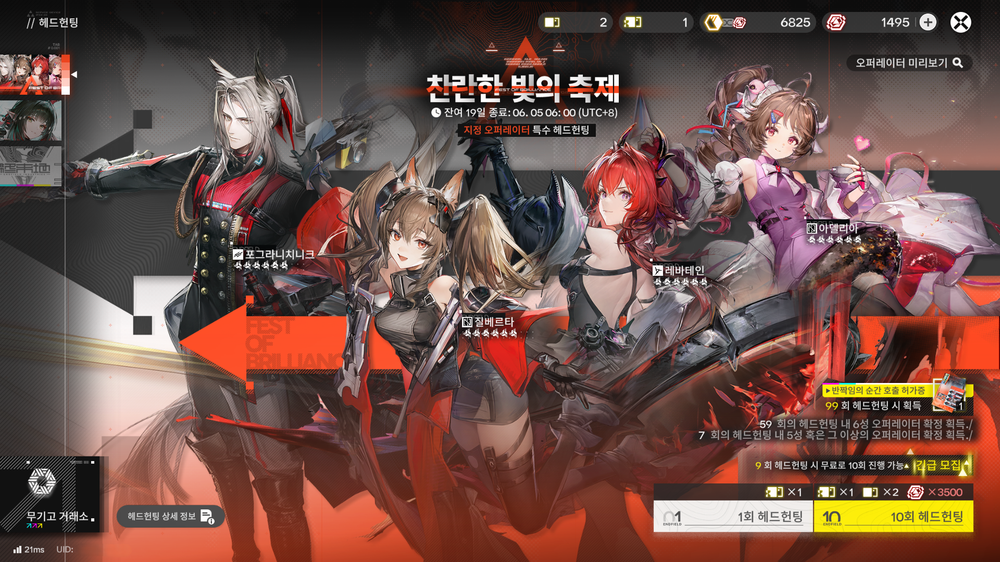
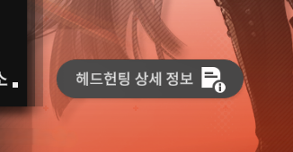
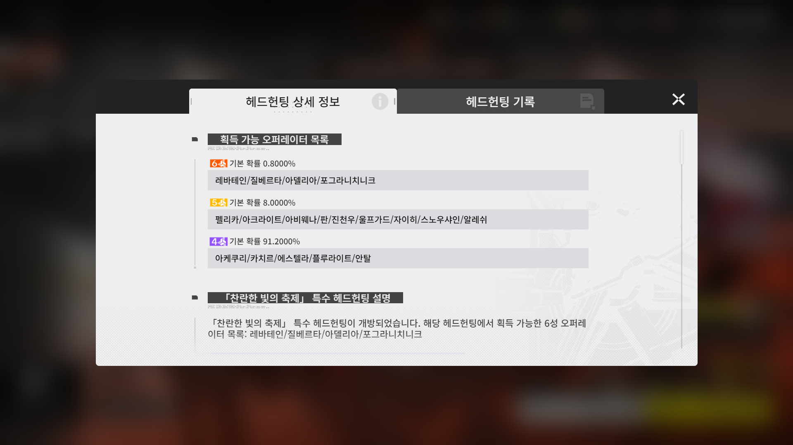
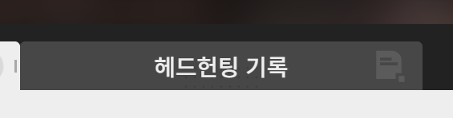
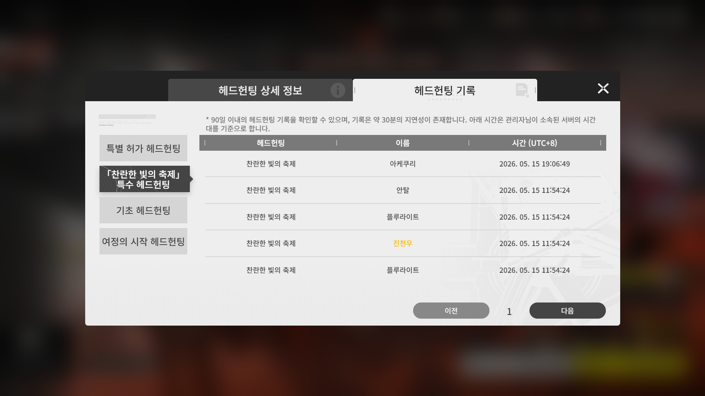
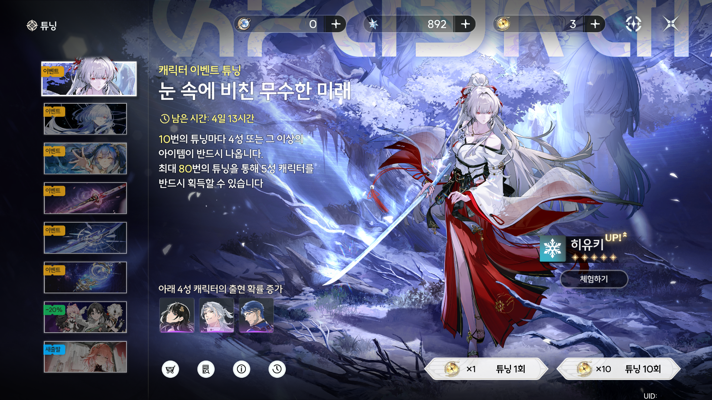
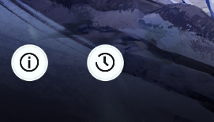
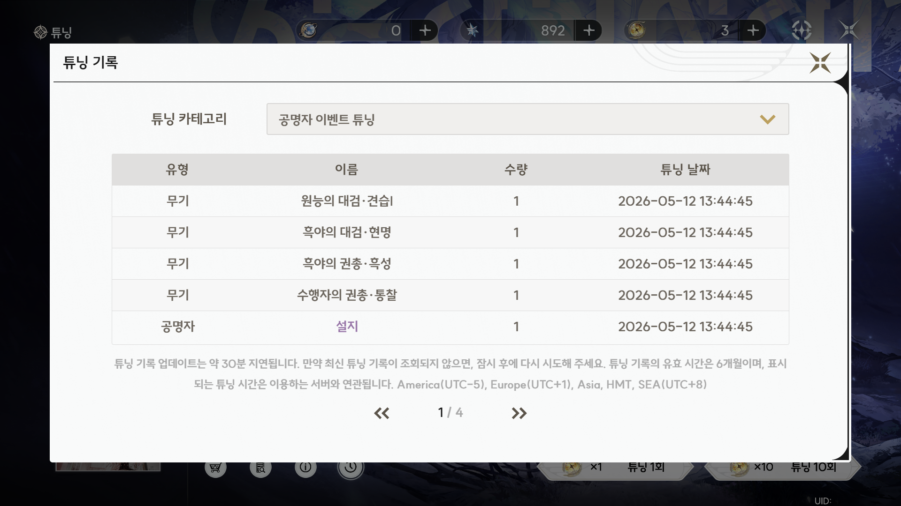

# Common

Each game requires its in-game gacha history screen to be open, just like the images shown below, for the tracker to work correctly.

# Contents

- [Arknights: Endfield](#arknights-endfield)
- [Wuthering Waves](#wuthering-waves)

# Arknights: Endfield

| Unified Name | In-Game Name |
|--------------|--------------|
| Gacha        | Headhunting  |
| Character    | Operator     |

This game uses a token-based method.

The token is believed to be permanent.

`C:\Users\<USER>\AppData\Local\PlatformProcess\Cache\data_1`

 
 
 
 

# Wuthering Waves

| Unified Name | In-Game Name |
|--------------|--------------|
| Gacha        | Tuning       |
| Character    | Resonator    |

This game uses a URL-based method.

The URL is usually valid for about 30 minutes.

`<Driveletter>:\Wuthering Waves\Wuthering Waves Game\Client\Saved\Logs\Client.log`

or

`Steam\steamapps\common\Wuthering Waves\Wuthering Waves Game\Client\Saved\Logs\Client.log`

 
 

