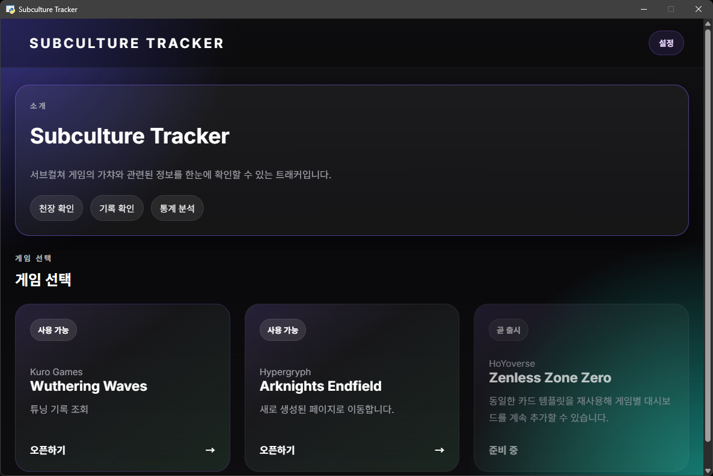
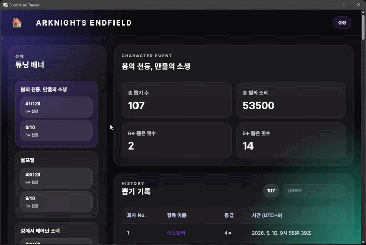

# Subculture Tracker

<picture>
  <source media="(prefers-color-scheme: dark)" srcset="demo/source/app-icon-black.webp" height="240">
  <source media="(prefers-color-scheme: light)" srcset="demo/source/app-icon-black.webp" height="240">
  
</picture>

Subculture Tracker는 지원되는 게임의 가챠 기록을 자동으로 수집해 공통 JSON 형식으로 저장하고, 데스크톱 창에서 바로 확인할 수 있게 해주는 도구입니다.

복잡한 설정 없이 바로 사용할 수 있도록 구성했습니다.

- 원본 기록 데이터를 자동 추출하고 공통 JSON 형식으로 변환
- 웹 인터페이스를 데스크톱 창에서 실행
- 수동 복사 없이 기록을 불러오고 관리

 

문서:

- 영문 README: [README.md](README.md)
- 개발 문서: [README_DEV_KO.md](README_DEV_KO.md)

## 지원 게임

- Wuthering Waves
- Arknights Endfield

게임별 세부 내용과 제한 사항은 [GAME.md](GAME.md)를 참고하세요.

## 설치

1. [Releases](https://github.com/jyc8369/subculture_tracker/releases) 페이지에서 최신 버전을 다운로드합니다.
2. 아래와 같은 이름의 파일을 받습니다.

```txt
subculture_tracker_X.X.X.zip
```

3. 압축을 풀고 Windows에서는 `SCT.exe`를 실행합니다.
4. 소스에서 실행하거나 `pywebview`가 없는 경우에는 `python run.py -dev`로 브라우저 모드에서 실행할 수 있습니다.

## 사용 방법

1. 추적할 게임을 실행합니다.
2. 게임 안에서 가챠 기록 또는 기록 화면을 엽니다.
3. Subculture Tracker를 열고 실행 중인 게임을 선택합니다.
4. `setting`을 클릭해 프로필 이름을 입력한 뒤 `Update/Create Data`를 누릅니다.
5. 데이터 생성이 끝나면 하단의 `Select profile file` 목록에서 저장된 기록을 불러올 수 있습니다.

## 데이터 형식

수집된 결과는 PC 로컬에 JSON 파일로 저장됩니다.

예시:

- `wuwa_<profilename>.json`
- `endfield_<profilename>.json`
- `web-setting.json`

이 프로젝트는 현재 Windows 기준으로 동작합니다. 일반 데스크톱 창은 `pywebview`에 의존하며, `-dev`는 브라우저 대체 실행 모드입니다.

## FAQ

<details>
<summary>정지 당할 수 있나요?</summary>

Subculture Tracker는 게임 파일을 수정하거나 메모리를 조작하지 않습니다.

게임 로그에 들어 있는 WebView 관련 정보를 읽고, 게임 자체가 사용하는 기록 조회 페이지를 통해 동작합니다.

개발 및 테스트 과정에서 현재까지 계정 제한이나 경고 사례는 확인되지 않았습니다.

다만 운영 정책은 언제든 바뀔 수 있으며, 사용 책임은 사용자 본인에게 있습니다.

</details>

<details>
<summary>원리가 뭔가요?</summary>

대부분의 지원 게임은 가챠 기록을 확인할 수 있는 기능을 제공합니다.

일부 게임은 게임 내부 WebView로 해당 기록을 보여줍니다. 이 경우 게임 로그에 WebView URL 또는 관련 정보가 남으며, Subculture Tracker는 이를 자동으로 찾아 기록 조회 엔드포인트를 열고 결과를 보기 쉬운 형태로 정리합니다.

</details>

<details>
<summary>다른 게임도 지원하나요?</summary>

추가 지원 가능성은 있습니다. 다만 게임마다 시스템, 용어, 저장 방식이 다르므로 직접 분석과 테스트가 필요합니다.

</details>

<details>
<summary>WebView를 쓰지 않는 게임은 지원이 불가능한가요?</summary>

현재 방식은 WebView 기반 기록 페이지를 전제로 합니다. 메모리를 직접 읽는 방식 같은 대안은 위험도가 높아 현재는 계획하지 않고 있습니다.

</details>

<details>
<summary>오류가 발생했어요.</summary>

[GitHub Issues](https://github.com/jyc8369/subculture_tracker/issues)에 아래 내용을 포함해서 제보해 주세요.

- 어떤 기능을 사용 중이었는지
- 어떤 오류가 발생했는지
- `lastlog.log` 파일

</details>

<details>
<summary>데이터는 어디에 저장되나요?</summary>

수집된 데이터는 사용자 PC 내부에만 저장됩니다. 프로그램이 외부 서버로 데이터를 전송하지 않습니다.

</details>

<details>
<summary>게임 데이터를 추출하지 못했다고 나와요.</summary>

아래 항목을 확인해 주세요.

- 게임 내 기록 화면을 열었는지
- 게임이 일반적인 경로에 설치되어 있는지

대표적인 실패 원인:

- 일부 게임은 시간이 지나면 URL 또는 토큰이 만료됨
- 자세한 내용은 [GAME.md](GAME.md)를 참고

</details>
